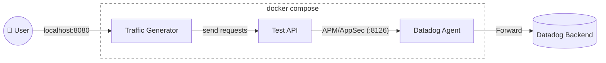

# AppSec Dogfooding Lab

This lab is designed to test specific features of Datadog App and API Protection in a reproducible way across various setups:



## Prerequisites

Required tools:
- Docker: [installation instructions](https://docs.docker.com/get-started/get-docker/)
- uv: [installation instructions](https://docs.astral.sh/uv/getting-started/installation/)

## Quick Start

From this `appsec/` directory:

### 1. Set environment variables

Get a Datadog API Key for your organization [here](https://app.datadoghq.com/organization-settings/api-keys).

```bash
export DD_API_KEY="<your_datadog_api_key>"
export DD_SITE="datadoghq.com"   # optional, defaults to datadoghq.com
export DD_ENV="local"            # optional, default to $USER
```

### 2. Start the lab

```bash
uv run start-stack
```

When prompted, choose an implementation of the test API:
- python/fastapi
- go/gin

### 3. Open the UI

The traffic generator should automatically open in your browser otherwise navigate to: [http://localhost:8080](http://localhost:8080/dogfooding)

Then:
1. Expand a scenario.
2. Click `Run scenario`.
3. Review step-by-step execution results.
4. Use the Datadog result link card to inspect findings in Datadog.

## Stop the Lab

Press `Ctrl+C` in the terminal where `uv run start-stack` is running.

## Developer Documentation

See `DEVELOPER.md` for architecture details, scenario authoring, and API documentation workflow.
